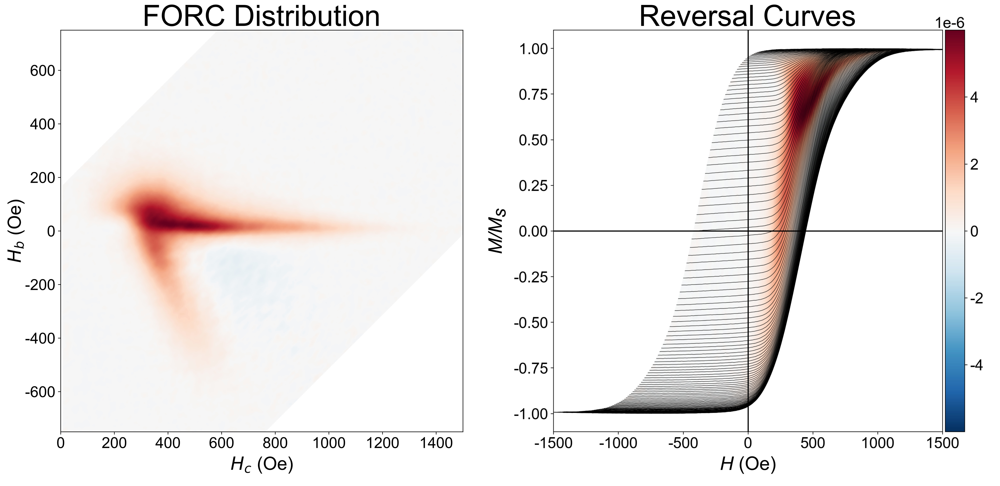

[](https://lbesson.mit-license.org/)

# pyforc

FORC analysis in Python.


## Installation

### Install from PyPI

The easiest way to get started is by installing via `pip`:

`pip install pyforc`

This will grab the latest published release on the Python Package Index and
install it to your current python environment.

### Installation from source

Install from source by doing

`pip install git+https://github.com/peytondmurray/pyforc`

Alternatively you can clone this repo and run

`pip install .`

## Contributions

Contributions are welcome - open an issue or create a pull request. I'm trying
to stick to PEP8 as much as I can, except I'm using line lengths of 100
characters. I'm using numpydoc formatting for the documentation as well. Don't
worry too much about this stuff though, we can work together to integrate your
code.

### Pre-commit hooks

This project makes use of [pre-commit hooks](https://pre-commit.com/) for
linting and style checking. If you haven't used pre-commit hooks before, first
install pre commit:

```bash
pip install pre-commit
```

Then inside the repository install the hooks themselves:

```bash
pre-commit install
```

Now, pre-commit hooks will run automatically any time you type `git commit`.

## Usage

Let's analyze a FORC dataset. Currently `pyforc` support data in from Princeton
Measurement Corporation (PMC) vibrating sample magnetometers (VSM). The data
comes in two formats.

### Hc/Hb Format

The first component is a header containing metadata about the dataset, including
measurement configuration details, temperature, number of curves and data
points.

The reversal curves come after this, with each curve containing

1. A single _drift_ measurement, which is a measurement of the magnetization
   carried out at some magnetic field $H$ above the field at which the magnet is
   known to be saturated, $H_{sat}$.
2. A series of magnetization measurements at a monotonically increasing magnetic
   field $H$, with a constant[^1] spacing between data points.

```
MicroMag 2900/3900 Data File (Series 0015)
First-order reversal curves
Configuration   :  VSM
Hardware version:  0004
Software version:  09/27/2005 D
Units of measure:  cgs
Temperature in  :  Kelvin
01/22/2015  17:35
"Delaware FeCo D 20nm wires OOP FORC"

Averaging time = +2.000000E+00
Hb1            =  0.000000E+00
Hb2            = +2.500000E+03
Hc1            = +1.500000E+03
Hc2            = +4.000000E+03
HCal           = +6.804196E+03
HNcr           = +3.500000E+01
HSat           = +1.500000E+04
NCrv           = 152
PauseCal       = +1.000000E+00
PauseNtl       = +3.000000E+00
PauseSat       = +1.000000E+00
SlewRate       = +1.000000E+04
Smoothing      = 3

Field range    = +6.804196E+03
Moment range   = +2.000000E-03
Temperature    = N/A
Orientation    = -9.000001E+01
Elapsed time   = +7.236108E+04
Slope corr.    = N/A
Saturation     = N/A
NData          = 30628

+6.808018E+03,+1.282651E-03            <---- Drift measurement

+1.140678E+03,+1.220527E-03            <---- Start of a reversal curve
+1.174292E+03,+1.220665E-03
+1.211422E+03,+1.221466E-03
+1.244758E+03,+1.222031E-03
+1.281733E+03,+1.221932E-03
+1.315307E+03,+1.222621E-03
...

```

### H/Hr Format

## Other FORC software

- [FORCinel](https://earthref.org/FORCinel/): Uses LOESS to caclulate the FORC
  distribution. Freeware, but requires IGOR Pro, so I've never used it, and I
  don't know how it handles the reversible ridge. Smoothing is done by
  increasing the LOESS radius.
- [Quantum
  Design](https://qdusa.com/siteDocs/productBrochures/1084-500_PPMS_FORC.pdf)
  has FORC software that can calculate the distribution in real time,
  apparently. I've never used this as I don't have a PPMS, and there's no
  publicly available source, so there's no way to know how the distribution is
  calculated, how the reversible ridge is handled, or how smoothing is done.
- [FORCIT](https://github.com/peytondmurray/forcit) (originally hosted at the
  [UC Davis paleomag group
  site](http://paleomag.ucdavis.edu/software-forcit.html) which is no longer
  hosted). Uses a finite-difference method for calculating the FORC
  distribution, and requires the Generic Mapping Tools to run. This can take an
  extremely long time to run (~15 min was not uncommon in my lab, despite being
  written in Fortran). Handles the reversible ridge by using a constant
  extension for $H<Hr$. Smoothing is done by applying a 2D gaussian filter
  before differentiation.
- [Chris Pike's original Mathematica
  script](https://github.com/peytondmurray/pike-forc). Nigh unusable at this
  point, this is the original Mathematica script Chris Pike used to calculate
  FORC distributions.

[^1]: Not actually constant, but we account for this in the data processing by
    interpolating the dataset over a constant field step.
